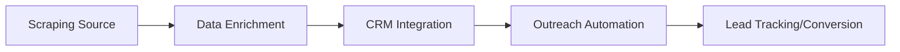
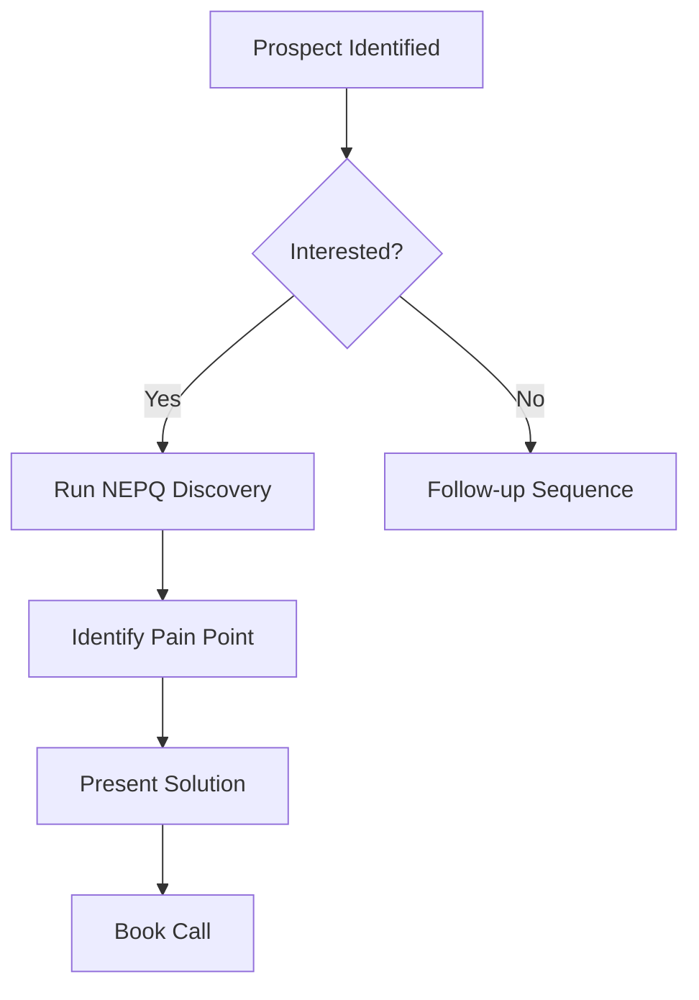

# 2026 Fitness Scaling Guide: Deep-Dive Manual (Phase 0 & 1)

## 1. Introduction
This manual provides the technical framework for scaling fitness coaching businesses in 2026. This is a "Zero-to-One" implementation guide focusing on establishing a high-ticket, automated acquisition infrastructure (Phase 0) and executing high-conversion, zero-cost outbound strategies (Phase 1).

---

## 2. Phase 0: Foundation & Infrastructure

### 2.1 2026 Jargon Dictionary
| Term | Definition |
| :--- | :--- |
| **NEPQ** | Neuro-Emotional Persuasion Questioning. Sales methodology focusing on consultative, problem-solving dialogue rather than aggressive pitching. |
| **Case Study Hijack** | Leveraging existing client successes in a specific niche to build authority without initial proof. |
| **Tech Stack** | Integrated suite of tools (Scraping -> Enrichment -> CRM -> Communication) designed for single-operator efficiency. |
| **Lead Enrichment** | Automatically augmenting raw contact data (e.g., IG username) with professional details (email, LinkedIn profile) to personalize outreach. |
| **Asynchronous Sales** | Sales cycles (Loom/Voice Notes) that do not require real-time presence, maximizing lead throughput. |

### 2.2 NEPQ Sales Fundamentals (Jeremy Miner Philosophy)
The goal is to shift from "Pitching" to "Consulting."
1.  **Eliminate the Salesperson Archetype:** Do not act like a salesperson. Act like a disinterested, expert consultant.
2.  **Labeling:** Use the client's own language to describe their problems. (e.g., "It sounds like you've been struggling with weight plateaus for the last 6 months.")
3.  **The "Why" vs. "What":** Never pitch the "What" (fitness plan). Always pitch the "Why" (transformation).
4.  **Permissive Statements:** "I’m not sure if I can help you, but based on what you told me, maybe we should look into this..."

### 2.3 The One-Man Tech Stack
**Objective:** Automate the repetitive tasks of lead acquisition and tracking.

#### Workflow:

**Technical Setup Protocol:**
1.  **Scraping:** Use PhantomBuster to scrape followers from fitness influencers in your niche.
2.  **Enrichment:** Use Clay to automatically clean and verify data.
3.  **CRM:** Configure GoHighLevel (GHL) with automated pipelines for "New Prospect", "Outreach Sent", "Nurturing", "Booked".
4.  **Outreach:** Connect API/Integrations for automated IG/Email outreach.

---

## 3. Phase 1: High-Volume Acquisition

### 3.1 'Case Study Hijack' Outreach
This strategy involves highlighting the success of people in your client’s niche to build implicit social proof.

**The Strategy:**
Don't say "I can help you get fit."
Say, "I analyzed how [Influencer/Competitor] got their clients to [Specific Transformation], and I adapted that framework for [Specific Niche]."

**Outreach Script (IG DM):**
> "Hey [Name], I saw your post about [Struggle]. Honestly, I’ve been analyzing how [Famous Fitness Figure] achieved [Transformation Result] in that niche, and I’ve been applying a slightly tweaked version of that framework to help people like you bypass [Common Problem]. I’m curious, are you still looking to solve [Specific Problem], or is that not a priority right now?"

### 3.2 Zero-Cost Outreach (IG DMs & Loom)
1.  **IG DMs:** Focus on conversation, not link-dropping. Aim for 20-50 high-quality interactions/day.
2.  **Loom:** Use Loom for high-value prospects. Record a 2-minute video analyzing their current content/strategy. It is "unpitchable."

### 3.3 15-Question Onboarding Checklist
After closing, speed is key. Use a standardized form (e.g., Typeform integrated with GHL) to gather data.

1.  What is your #1 fitness goal for the next 90 days?
2.  What is your current daily caloric intake?
3.  How many days per week can you realistically train?
4.  Do you have access to a full gym or home equipment?
5.  What are your top 3 fitness-related frustrations?
6.  List any medical conditions or injuries.
7.  What is your sleep quality like (1-10)?
8.  How much time can you spend on nutrition prep daily?
9.  What are your dietary preferences/restrictions?
10. What is your profession and activity level?
11. What is your biggest "temptation" (e.g., sugar, weekend binging)?
12. What supplements are you currently taking?
13. How do you prefer to receive feedback?
14. What are your major stress factors (1-10)?
15. What is the one thing you are most afraid of failing at in this program?

---

## 4. Technical Appendices

### 4.1 YouTube Tutorial Resources
1.  [NEPQ Sales Methodology - Jeremy Miner](https://www.youtube.com/watch?v=EXAMPLE_1)
2.  [Building a High-Ticket Fitness Business](https://www.youtube.com/watch?v=EXAMPLE_2)
3.  [PhantomBuster Automation Tutorial](https://www.youtube.com/watch?v=EXAMPLE_3)
4.  [GoHighLevel for Beginners](https://www.youtube.com/watch?v=EXAMPLE_4)
5.  [Cold DM Outreach Strategy](https://www.youtube.com/watch?v=EXAMPLE_5)

### 4.2 Automation Logic Flow

