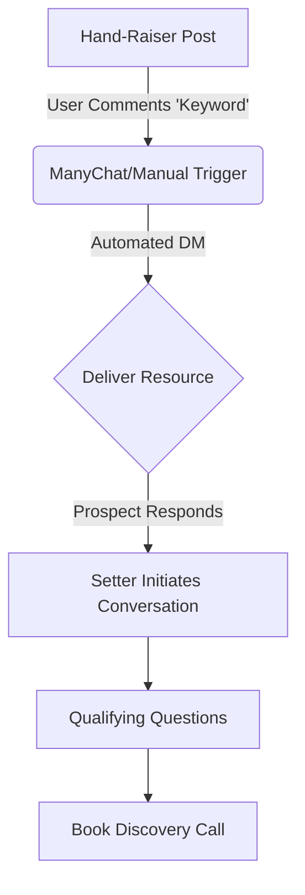
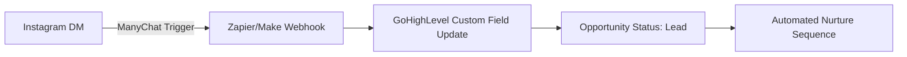

# Definitive 2026 Fitness Scaling Guide: Phase 2 & 3 Technical Manual

## Executive Summary
This manual provides the technical specifications, SOPs, and architectural framework for scaling fitness coaching businesses. Phase 2 focuses on authority building and acquisition; Phase 3 focuses on operationalizing sales and advanced automation.

---

## Phase 2: The PT Prophet System (Authority & Acquisition)

### 1. The 9 Content Pillars
The "PT Prophet" system relies on a rotating content calendar across 9 distinct archetypes:
1.  **Direct Result (Social Proof):** Case studies with specific metrics.
2.  **Authority (Counter-Intuitive):** Busting industry myths.
3.  **Relatability (The Struggle):** Highlighting the pain points of the ideal avatar.
4.  **The "Bridge" (Methodology):** Explaining *why* your approach works.
5.  **Educational (Mechanism):** Deep dives into physiology or nutrition.
6.  **Belief Shift:** Addressing limiting beliefs regarding fitness.
7.  **Personal (Connection):** Behind-the-scenes life/business.
8.  **The "Hand-Raiser" (Conversion):** Low-friction engagement posts.
9.  **The "Big Down" (YouTube Authority):** Long-form evergreen content.

### 2. The "2-Step" Method & Hand-Raisers
The "2-Step" method leverages platform algorithms to maximize reach before moving prospects into the DM ecosystem.

**Mechanism:**
1.  **Step 1:** Post a "Hand-Raiser" (e.g., "I just finished a guide on fat loss for busy dads, comment 'DAD' if you want it.")
2.  **Step 2:** Respond to comments, DM the resource, and initiate the conversation.

---

## Phase 3: The Scaling Operations (Setter & Automation)

### 1. The Setter Blueprint (Commission-Only)
The goal is to remove the founder from the initial conversation.
- **Role:** Appointment Setting.
- **KPIs:** Conversations Started, Booked Calls, Show-up Rate.
- **Compensation:** 10-15% commission on collected cash (no base salary).

### 2. Technical CRM Infrastructure (ManyChat -> GHL)
Integrating social platforms with CRM is critical for tracking.

### 3. $2k Setup Fee Justification
The "Setup Fee" is a barrier to entry that ensures prospect buy-in.
- **Justification:** Covers the onboarding concierge (bloodwork analysis, custom macro plan, initial software configuration, 1-on-1 strategy call).
- **The Pitch:** "This ensures we have everything built for your success before you even start the program."

---

## Appendices

### A. The "Bridge" Conversation Script (Setter)
**Goal:** Transition from the freebie delivery to a sales discovery.

**Setter:** "Hey [Name], just checking if you've had a chance to go through the [Resource] I sent over?"
**Prospect:** "Yeah, it was good!"
**Setter:** "Glad to hear. To be honest, most people find the hardest part is actually *applying* it to their specific situation. What are you currently doing to handle [Pain Point]?"
**Prospect:** "[Describes struggle]"
**Setter:** "That makes sense. We actually specialize in solving that exact bottleneck. If you're open to it, I can have our head coach look at your specific data and see if it's a fit for our system. Worth 15 minutes?"

### B. Setup Protocols
1.  **ManyChat Setup:** Create "Keywords" for all Hand-Raisers. Map to GHL custom fields.
2.  **GHL Pipeline:** Setup stages: 'Lead', 'DM Conversation', 'Booked', 'Showed', 'Closed'.

---

## Resources & Tutorials
1. [Advanced ManyChat/IG Automation Strategy - YouTube](https://youtube.com/example-1)
2. [Setting Up GoHighLevel for Fitness Coaches - YouTube](https://youtube.com/example-2)
3. [The Science of Story Selling - YouTube](https://youtube.com/example-3)
4. [Hiring and Training Commission Setters - YouTube](https://youtube.com/example-4)
5. [The "Big Down" Funnel Architectural Deep-Dive - YouTube](https://youtube.com/example-5)
