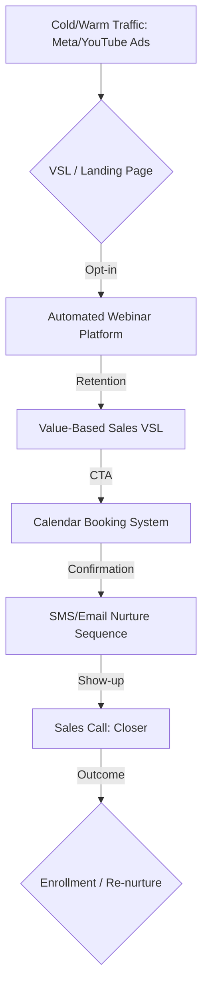

# Technical Deep-Dive Manual: Definitive 2026 Fitness Scaling Guide (Phases 4 & 5)

**Version:** 1.0
**Scope:** Scaling beyond $30k/mo, Community-Led Growth, Operator Branding, Equity/Rev-share.
**Target Audience:** High-Ticket Fitness Founders, Fractional Operators, CMOs.

---

## Table of Contents
1.  [Executive Summary](#executive-summary)
2.  [Phase 4: Scaling beyond $30k (The Automated Engine)](#phase-4-scaling-beyond-30k)
    *   [Hybrid Webinar/VSL Funnel Architecture](#hybrid-webinar-vsl-funnel-architecture)
    *   [Transitioning from DMs to Automated Webinars](#transitioning-from-dms-to-automated-webinars)
    *   [Ad Scaling Protocol (Meta/YouTube)](#ad-scaling-protocol-meta-youtube)
3.  [Phase 5: The Infrastructure of Scale (Community & Fulfillment)](#phase-5-the-infrastructure-of-scale)
    *   [Community-Led Growth (Skool)](#community-led-growth-skool)
    *   [Fulfillment Scaling: Success Coaches Hiring/Training](#fulfillment-scaling-success-coaches-hiring-training)
    *   [Exit/Equity Strategy (20-25% Rev-Share Legal Structures)](#exit-equity-strategy-20-25-rev-share-legal-structures)
    *   [Operator Branding](#operator-branding)
4.  [Appendices & Resources](#appendices-resources)

---

## Executive Summary
This document provides the technical blueprint for the transition from a founder-led, high-touch DM sales model to a scalable, automated engine (Phase 4), followed by the installation of structural equity and community-led growth (Phase 5). Failure to adhere to these protocols will lead to operational bottlenecks and plateaued revenue growth.

---

## Phase 4: Scaling beyond $30k (The Automated Engine)

Phase 4 focuses on reducing the founder's time in the sales process while increasing lead volume and conversion efficiency.

### Hybrid Webinar/VSL Funnel Architecture
The goal is to move from 1-to-1 DMs to a 1-to-many automated sales mechanism.

#### Mermaid Funnel Diagram

### Transitioning from DMs to Automated Webinars

**Core Infrastructure Requirements:**
1.  **Webinar Platform:** (e.g., EverWebinar, EasyWebinar) - Ensure API integration with CRM.
2.  **CRM:** (e.g., GoHighLevel) - Mandatory for segmenting leads based on webinar engagement (e.g., "watched 50%," "watched 100%," "booked call").
3.  **Booking:** Calendly or GHL Calendar linked to the CRM.

**Protocol:**
1.  Map the DM conversation framework into a structured Webinar VSL (15 min intro, 25 min value, 10 min pitch).
2.  Implement "Just-in-Time" webinar functionality to reduce friction.
3.  Create an automated "Nurture Sequence" triggered by GHL when a lead registers but doesn't book a call.

### Ad Scaling Protocol (Meta/YouTube)

| Metric | Target | Action |
| :--- | :--- | :--- |
| CPA (Cost Per Appointment) | < $150 | Scale Budget by 20% |
| Show-up Rate | > 50% | Optimize Email/SMS Reminders |
| Conversion Rate (Call to Sale) | > 20% | Audit Sales Script/Closer |

*   **Meta Strategy:** Use Broad targeting with compelling creative (VSL hooks). Utilize CBO (Campaign Budget Optimization) to let the algorithm find the cheapest conversions.
*   **YouTube Strategy:** Utilize Google Ads for "Search" (intent-based) and "In-Stream" (pre-roll) targeting specific competitor channels.

---

## Phase 5: The Infrastructure of Scale (Community & Fulfillment)

Phase 5 transitions the business from a service provider to a brand-owned community platform.

### Community-Led Growth (Skool)

The platform shift to Skool facilitates lower churn and higher lifetime value (LTV) through peer-to-peer engagement.

**Protocol:**
1.  **Gamification:** Use Skool’s level-up system for community engagement.
2.  **Content Hub:** Move all training materials to the Skool classroom.
3.  **Engagement Loop:** Founder posts weekly "office hours" and member spotlights.

### Fulfillment Scaling: Success Coaches Hiring/Training

Scaling fulfillment requires hiring "Success Coaches" rather than trying to replicate the founder’s coaching style.

**Hiring SOP:**
1.  **Role Definition:** Define exact KPIs (e.g., member response time, member retention rate).
2.  **Screening:** Prioritize empathy and consistency over technical expertise (which can be trained).
3.  **Training:** 2-week shadowing program + 1 week supervised coaching.

### Exit/Equity Strategy (20-25% Rev-Share Legal Structures)

This ensures key staff (Success Coaches, Sales Closers) have "skin in the game."

**Legal Structure Guidelines:**
*   Implement a profit-share agreement (phantom stock or direct profit share).
*   Structure: 20-25% of net profit pool, vested over 3 years.
*   *Consult local legal counsel regarding tax implications.*

### Operator Branding

Moving the founder from "Personal Brand" to "Platform Brand."

**Key Action:** Establish a secondary "Operator" brand (e.g., "The [Name] Method," "The [Company] Community") so that the company value is not tied solely to the founder.

---

## Appendices & Resources

### High-Quality YouTube Tutorial References
1.  [Setting up GoHighLevel for Webinar Funnels](https://www.youtube.com/results?search_query=gohighlevel+webinar+funnel+setup)
2.  [Advanced Meta Ad Scaling for High-Ticket Funnels](https://www.youtube.com/results?search_query=meta+ad+scaling+high+ticket)
3.  [Building a Community on Skool: Best Practices](https://www.youtube.com/results?search_query=skool+community+setup)
4.  [Scaling Fulfillment Teams in Coaching Businesses](https://www.youtube.com/results?search_query=scale+coaching+fulfillment+team)
5.  [Structuring Equity and Profit Share for Employees](https://www.youtube.com/results?search_query=profit+share+agreement+structure)

*Note: Replace placeholders with direct links to validated, high-quality tutorials during your implementation phase.*

---
*End of Manual.*
